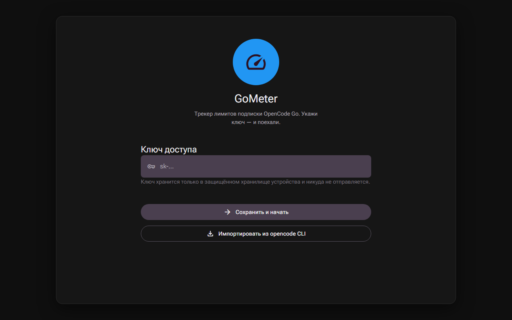
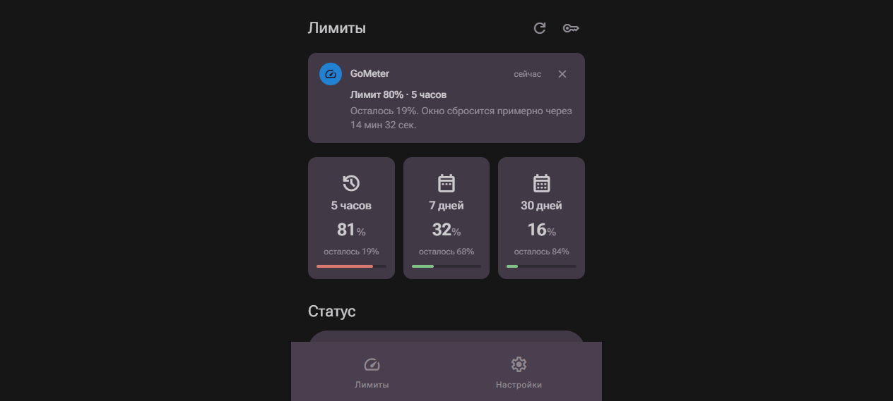
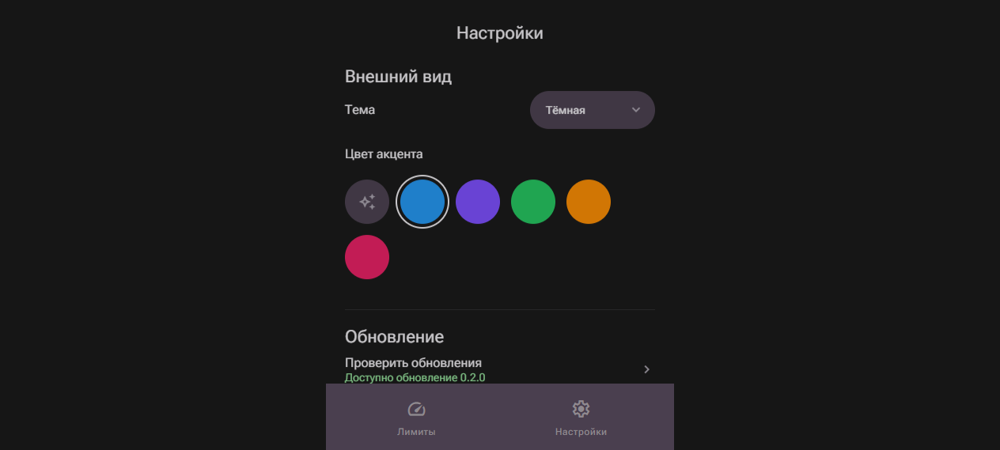
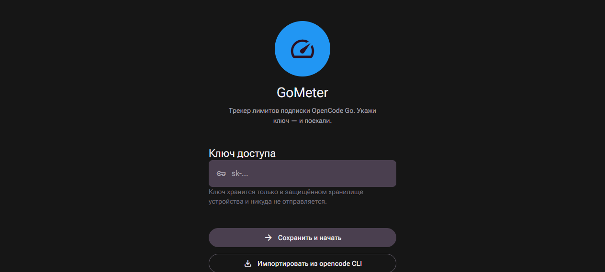
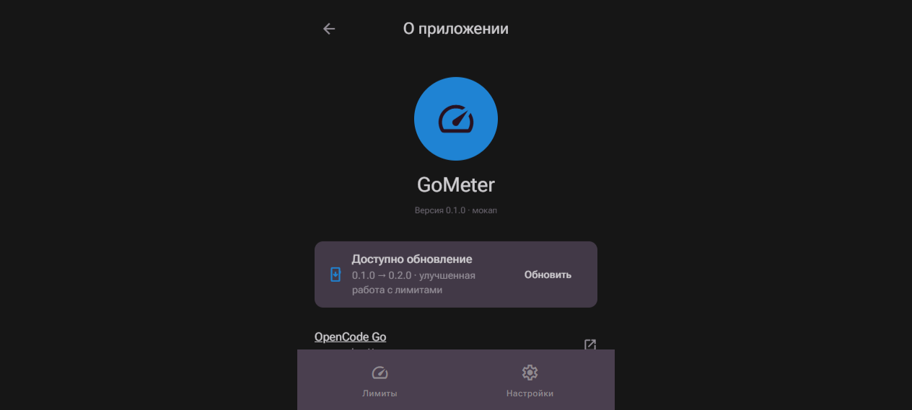

<p align="center">
  
</p>

<h1 align="center">GoMeter — OpenCode Go Limits Tracker</h1>

<p align="center">
  Трекер лимитов подписки OpenCode Go · Rolling 5ч · Weekly · Monthly · Трей · Уведомления 80/95
</p>

<p align="center">
  <a href="https://github.com/gz0ni/GoMeter/releases/latest"></a>
  <a href="https://github.com/gz0ni/GoMeter/actions/workflows/build.yaml"></a>
  
  
  
  
</p>

<p align="center">
  <a href="#скачать">Скачать</a> ·
  <a href="#быстрый-старт">Быстрый старт</a> ·
  <a href="#установка">Установка</a> ·
  <a href="#разработка">Разработка</a>
</p>

---

## Возможности

| | Фича | Описание |
|---|---|---|
| 📊 | **Лимиты в реальном времени** | `Rolling 5ч` / `Weekly` / `Monthly` через `https://opencode.ai/zen/go/v1/usage`, живой обратный отсчёт `resetIn` |
| 🔔 | **Пуш-карты и уведомления** | Пороги `80%` / `95%`, одно уведомление на окно до сброса (`NotificationHistory`), предпросмотр `PhoneNotif` |
| 🖥️ | **Трей (X11/Wayland)** | `ЛКМ → окно`, `ПКМ → меню`, сингл-инстанс `G_APPLICATION_FLAGS_NONE`, `setPreventClose(true)`, `StatusNotifierItem` через `libayatana-appindicator3-1` |
| 🚀 | **Автостарт** | Windows `Registry Run`, Linux `~/.config/autostart/gometer.desktop`, macOS `LaunchAgents/dev.gometer.gometer.plist`, `--quiet` тихий старт в трей |
| 🎨 | **Material 3** | `DynamicColor` + 6 `AccentSeed` (`auto/blue/violet/green/orange/pink`), `dark` по умолчанию, адаптивный `Shell` (2 таба `<600px` / `Rail 240px` `DesktopNarrow 640px`) |
| 🔑 | **Импорт ключа** | Из `opencode CLI` `auth.json` (`opencode-go`/`zen`/`opencode` → `key`/`token`, fallback `token`/`access_token`), ручной ввод `sk-...` |

---

## Скриншоты

> Статичные `PNG` из `docs/gometer-mockup-md3/` (`index.html` / `desktop.html`) — источник правды для UI.

| Desktop (Rail 240px) | Mobile — Лимиты | Mobile — Настройки |
|---|---|---|
|  |  |  |

| Onboarding | О приложении |
|---|---|
|  |  |

*Если скрины не отображаются — открой `docs/gometer-mockup-md3/index.html` и `desktop.html` локально.*

---

## Скачать

> Релизы собираются `GitHub Actions` (`build.yaml`) по тегам `v*` (`Flutter 3.44.8`). Таблица как в релизе.

| OS | Download |
|---|---|
| **Android** | [](https://github.com/gz0ni/GoMeter/releases/latest) · [](https://github.com/gz0ni/GoMeter/releases/latest) · [](https://github.com/gz0ni/GoMeter/releases/latest) |
| **Windows** | [](https://github.com/gz0ni/GoMeter/releases/latest) · [](https://github.com/gz0ni/GoMeter/releases/latest) |
| **macOS** | [](https://github.com/gz0ni/GoMeter/releases/latest) |
| **Linux** | [](https://github.com/gz0ni/GoMeter/releases/latest) · [](https://github.com/gz0ni/GoMeter/releases/latest) · [](https://github.com/gz0ni/GoMeter/releases/latest) |

Прямые файлы последнего релиза: [`GoMeter-0.2.8-linux-amd64.deb`](https://github.com/gz0ni/GoMeter/releases/download/v0.2.8/GoMeter-0.2.8-linux-amd64.deb) · [`GoMeter-0.2.8-linux-amd64.tar.gz`](https://github.com/gz0ni/GoMeter/releases/download/v0.2.8/GoMeter-0.2.8-linux-amd64.tar.gz) · [`GoMeter-0.2.8-windows-amd64-setup.exe`](https://github.com/gz0ni/GoMeter/releases/download/v0.2.8/GoMeter-0.2.8-windows-amd64-setup.exe)

> `Linux` требует `Ubuntu 24.04+` / `Debian 13+` (`glibc 2.39`, `libayatana-appindicator3-1`). На `22.04` используй `tar.gz`.

---

## Быстрый старт

1. Установи `opencode CLI` и войди: `opencode auth login` (создаст `auth.json`).
2. Открой `GoMeter` → `Onboarding` / `Настройки → Доступ → Ключ доступа` → `Импортировать из opencode CLI` или вставь `sk-...` вручную → `Сохранить`.
3. Экран `Лимиты` покажет `Rolling`/`Weekly`/`Monthly` и `Статус`. `Обновлено недавно · проверка каждые 5 мин`.

---

## Установка

### Linux

```bash
# deb (рекомендуется, 24.04+)
sudo apt install ./GoMeter-0.2.8-linux-amd64.deb

# tar.gz (любой дистр, обходит зависимости)
tar -xzf GoMeter-0.2.8-linux-amd64.tar.gz
./bundle/gometer              # или ./bundle/gometer --quiet для тихого старта в трей

# rpm
sudo dnf install ./GoMeter-0.2.8-linux-amd64.rpm
```

Зависимости `deb`: `libgtk-3-0`, `libblkid1`, `liblzma5`, `libayatana-appindicator3-1` (`linux/packaging/deb/make_config.yaml:13`). На `22.04` был `0.1` — теперь `1`, поэтому `apt` падал с `Unsatisfied dependencies` — фикс в `v0.2.8` (`ubuntu-24.04` раннер `build.yaml:51`).

### Windows

`GoMeter-*-setup.exe` → `Next` (ставит в `Program Files`, добавляет `Start Menu` ярлык для `AUMID` тостов). `Portable zip` — распакуй и `GoMeter.exe`.

### macOS

`GoMeter-*.dmg` (`arm64`) → перетащи `GoMeter.app` в `/Applications`. Первый запуск: `xattr -d com.apple.quarantine /Applications/GoMeter.app` если Gatekeeper ругается.

### Android

`APK` из релиза → разреши `Установку из неизвестных источников`. Подпись `release` через `keystore` (`build.yaml:64`).

---

## Хранение и автозапуск

| Что | Где |
|---|---|
| Настройки `SharedPreferences` | `Linux` `~/.local/share/dev.gometer.gometer/shared_preferences.json` (`path_provider_linux:48` `xdg.dataHome`) <br> `macOS` `~/Library/Application Support/dev.gometer.gometer/` <br> `Windows` `%APPDATA%\dev.gometer.gometer\` |
| `auth.json` импорт | `Linux` `~/.local/share/opencode/auth.json` → `~/.config/opencode/auth.json` (`opencode_auth.dart:25`) <br> `macOS` `~/.local/share` → `~/Library/Application Support/opencode/auth.json` → `~/.config` <br> `Windows` `~/.config` → `~/.local/share` → `%APPDATA%\opencode\auth.json` |
| Автозапуск | `Linux` `~/.config/autostart/gometer.desktop` <br> `macOS` `~/Library/LaunchAgents/dev.gometer.gometer.plist` <br> `Windows` `HKCU\Software\Microsoft\Windows\CurrentVersion\Run` `GoMeter` → `"<exe>" [--quiet]` |
| Кэш/загрузки обновлений | `getApplicationSupportDirectory()` / `getDownloadsPath()` |

Проверить на `Linux`:
```bash
cat ~/.local/share/dev.gometer.gometer/shared_preferences.json | python3 -m json.tool
cat ~/.local/share/opencode/auth.json | python3 -m json.tool
ls -lh ~/.config/autostart/gometer.desktop
```

---

## Трей, Wayland и XFCE

* Сингл-инстанс `linux/runner/my_application.cc:26` `g_main_window` + `gtk_window_present` (Wayland `xdg-activation` + X11 `present_with_time`), флаг `G_APPLICATION_FLAGS_NONE` (`my_application_new:157`).
* `lib/main.dart:60` `setPreventClose(true)` + `TrayController:107` `hide` — крестик уводит в трей, `Выход` в меню делает `destroy+exit(0)`.
* `XFCE X11`: нужен `Indicator Plugin` или `Status Tray Plugin` для `StatusNotifierItem`. `XFCE Wayland` пока не тестирован — проверено на `Ubuntu Wayland` (`GNOME`). Дубли иконок = был `G_APPLICATION_NON_UNIQUE` → фикс в `main` после `v0.2.8`.

---

## Разработка

```bash
flutter pub get
flutter analyze --no-fatal-infos
flutter test --reporter expanded
flutter run                 # dev
flutter run -d linux        # Linux bundle
dart setup.dart linux --env stable -v   # deb/rpm/tar.gz (требует ninja, libgtk-3-dev, libayatana-appindicator3-dev, rpm, patchelf)
dart setup.dart windows --env stable -v # exe/zip (Inno Setup)
dart setup.dart macos --env stable -v   # dmg (appdmg)
```

* `Flutter 3.44.8` `Dart ^3.12.2`, без `FVM` (`.agents/project.md:6`), `CI` `build.yaml` по `v*` тегам, артефакты в `dist/`.
* Иконки: `assets/images/png/icon-1024.png` → `flutter_launcher_icons` + `scripts/svg_to_png.mjs` + `generate_launcher_assets.dart`.

---

## Стек

`flutter_riverpod` · `go_router` · `dio` · `shared_preferences` · `package_info_plus` · `path_provider` · `url_launcher` · `tray_manager` · `window_manager` · `flutter_local_notifications` · `dynamic_color` · `flutter_foreground_task`

---

## Архитектура

Кратко: `main.dart` → `SharedPreferences` + `SettingsRepository` + `AppRouter` + `Dio/UpdateService/UsageApiService` + `ProviderScope` → `app.dart` `MaterialApp.router` (`ru_RU`, `DynamicColorBuilder`, `limitMonitorProvider`).

Подробно: [`.agents/architecture.md`](.agents/architecture.md) · Дизайн: [`docs/gometer-mockup-md3/`](docs/gometer-mockup-md3/) (моб. 2 таба `Лимиты/Настройки` + `Desktop Rail 240px` + `DesktopNarrow 640px`, тёмная `M3` `seed #2196F3`).

---

## Troubleshooting

| Симптом | Причина / Фикс |
|---|---|
| `Depends: libayatana-appindicator3-0.1 but it is not installable` | `v0.2.7` собран на `22.04`. Обновись до `v0.2.8+` (`24.04`, `1`) или `tar.gz` |
| Дубли иконок в трее, `N` процессов `gometer` | Был `NON_UNIQUE`, фикс `FLAGS_NONE` в `main` после `v0.2.8` |
| Трей не кликается на `XFCE` | Включи `Indicator Plugin` в панели, проверь `libayatana-appindicator3-1` установлен |
| Уведомления не приходят на `Linux` | Нет `notification daemon` (`dunst`/`notify-osd`) — `flutter_local_notifications` `best-effort` |
| `opencode` импорт пустой | `auth.json` нет → `opencode auth login`, проверь пути выше |

---

## Roadmap

- [x] `M3` аудит, `Rail`/`Shell`, `tray`/`autostart`/`quiet` (`resolveTrayIconPath` абсолютный путь для `System32`)
- [x] Живые пуш-карты `80/95` + `LimitMonitor` + `NotificationHistory` (анти-спам `notified-<window>-<threshold>-<reset>`)
- [ ] Ручная верификация `opencode_auth` на `Linux/macOS` (на `Windows` готово `test/e2e/usage_api_e2e_test.dart`)
- [ ] Тост на `Windows` с `AppUserModelID` + `Start Menu` ярлыком
- [ ] `BGTask`/`WorkManager` для фона `iOS/Android` (сейчас пока процесс жив)

---

<p align="center">
  <sub>© 2026 GoMeter · Данные об использовании не покидают устройство · <a href="https://opencode.ai/go">opencode.ai/go</a></sub>
</p>
